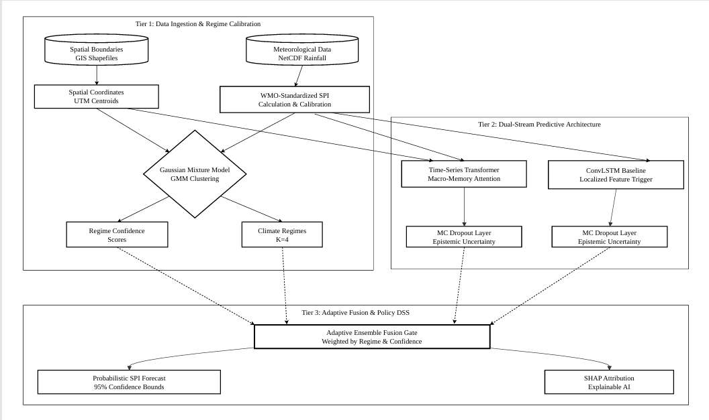

# 🌍 Calibrated Hydro-Climatic Regime Ensembles: An Explainable Deep Learning Framework for Drought Forecasting in the Cauvery River Basin

A state-of-the-art drought forecasting framework that integrates hydro-climatic data processing, climate regime discovery, deep learning, uncertainty quantification, and explainable AI to forecast drought conditions in the Cauvery River Basin.

The proposed framework combines **Gaussian Mixture Models (GMM)**, **Time-Series Transformer**, **ConvLSTM**, **Monte Carlo Dropout**, and **SHAP Explainability** to generate reliable and interpretable drought forecasts for water resource management.



---

## 📌 Project Highlights

- 🌧️ WMO-compliant Standardized Precipitation Index (SPI) computation
- 🗺️ Spatial preprocessing using GIS and watershed-level analysis
- 🌍 Climate regime discovery using Gaussian Mixture Model (GMM)
- 🤖 Deep learning forecasting using Transformer and ConvLSTM
- 🔀 Adaptive regime-aware ensemble framework
- 📊 SHAP-based Explainable AI
- 📈 Monte Carlo Dropout for uncertainty estimation
- 💧 Decision support for drought monitoring and water management

---

# 📂 Data Collection

The project utilizes publicly available hydro-meteorological datasets.

### 1. India Watershed Boundaries

**Source:** https://www.data.gov.in/resource/shape-watershed-boundaries-india

- Downloaded the complete India Watersheds shapefile.
- Used **QGIS** to isolate the **132 watersheds of the Cauvery River Basin**.
- Exported the extracted basin into:
  - GeoPackage (.gpkg)
  - CSV (.csv)

---

### 2. Digital Elevation Model (DEM)

**Source:** https://portal.opentopography.org/raster?opentopoID=OTSDEM.032021.4326.3

- Copernicus Global Digital Elevation Model
- Used for terrain-based spatial preprocessing and watershed analysis.

---

### 3. IMD Gridded Rainfall Dataset

**Source:** https://www.imdpune.gov.in/cmpg/Griddata/Rainfall_25_NetCDF.html

- India Meteorological Department (IMD)
- Daily rainfall grids
- Spatial Resolution: **0.25° × 0.25°**
- Data Period: **1981–2025**
- Format: **NetCDF (.nc)**

---

# ⚙️ Methodology

The complete workflow consists of the following stages:

```
Data Collection
        │
        ▼
Spatial Preprocessing (QGIS + GeoPandas)
        │
        ▼
Rainfall Extraction from NetCDF
        │
        ▼
Monthly Aggregation
        │
        ▼
SPI Computation (WMO Standard)
        │
        ▼
Climate Regime Discovery (GMM)
        │
        ▼
Deep Learning Models
    ├── Transformer
    └── ConvLSTM
        │
        ▼
Adaptive Regime-Aware Ensemble
        │
        ▼
Monte Carlo Dropout
        │
        ▼
SHAP Explainability
        │
        ▼
Final Drought Forecast
```

---

# 🛠️ Technologies Used

- Python
- Google Colab
- QGIS
- GeoPandas
- xarray
- rasterstats
- NumPy
- Pandas
- Scikit-learn
- TensorFlow 
- SHAP
- Matplotlib

---

# 📈 Model Performance

| Model | MAE | R² Score |
|------|------|----------|
| Transformer | 0.2410 | 0.8237 |
| ConvLSTM | 0.2064 | 0.8462 |
| Adaptive Ensemble | **0.2022** | **0.8537** |

---

# 📁 Repository Structure

```
.
├── Drought_Prediction.ipynb
├── figures/
├── README.md
├── requirements.txt
└── .gitignore
```

---

# 🚀 Key Features

- Watershed-level drought forecasting
- Spatially-aware climate regime clustering
- Explainable AI using SHAP
- Uncertainty-aware predictions using Monte Carlo Dropout
- Adaptive ensemble based on climate regimes
- Designed for drought monitoring and water resource planning

---

# 📌 Future Work

- Integration of temperature and evapotranspiration for SPEI computation
- Real-time data ingestion pipeline
- Interactive GIS dashboard
- Reservoir operation and irrigation decision support
- Deployment as a web-based decision support system

---

# 📄 Citation

If you find this project useful, please consider citing or referencing this repository.

---

# 👩‍💻 Author

**Sri Varshini A**

B.E. Computer Science and Engineering
St. Joseph's College of Engineering, Chennai
